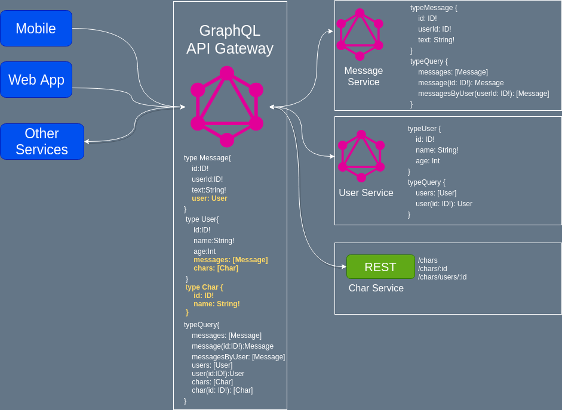

# GraphQL Gateway

<small>por [Adriano de Souza](mailto:souzadriano@gmail.com)</small>


---

## GraphQL Gateway

Único ponto de consulta de todas as APIs.
Transparente para os clientes.

---



---

## Depêndencias

```json
"dependencies": {
    "apollo-datasource-rest": "^0.3.2",
	"apollo-link": "^1.2.11",
	"apollo-link-context": "^1.0.17",
	"apollo-link-http": "^1.5.14",
	"apollo-server": "^2.4.8",
	"apollo-server-express": "^2.4.8",
    "express": "^4.16.4",
    "graphql": "^14.2.0",
	"graphql-iso-date": "^3.6.1",
	"graphql-resolve-batch": "^1.0.2",
	"graphql-tools": "^4.0.4",
	"graphql-validation-complexity": "^0.2.5",
    "node-fetch": "^2.3.0"
  }

```

---

## Imports

```js
const { ApolloServer, gql } = require("apollo-server-express");
const express = require("express");
const { createBatchResolver } = require('graphql-resolve-batch');
const {
	makeRemoteExecutableSchema,
	introspectSchema,
	mergeSchemas,
} = require('graphql-tools');
const fetch = require('node-fetch');
const { HttpLink } = require('apollo-link-http');
const { RESTDataSource } = require('apollo-datasource-rest');

```

---

## Fetch GraphQL Services

```js

const UserLink = new HttpLink({
    uri: 'http://localhost:4001/graphql',
    fetch,
});
const UserSchema = makeRemoteExecutableSchema({
    schema: await introspectSchema(UserLink),
    link: UserLink,
});

const MessageLink = new HttpLink({
    uri: 'http://localhost:4002/graphql',
    fetch,
});
const MessageSchema = makeRemoteExecutableSchema({
    schema: await introspectSchema(MessageLink),
    link: MessageLink,
});

```

---

## Schema do serviço em REST

```js
type Char {
    id: ID!
    name: String!
}
extend type Query {
    chars: [Char]
    char(id: ID!): [Char]
}

```

---

## Datasource do serviço REST

```js
class CharsAPI extends RESTDataSource {
	get baseURL() {
		return `http://localhost:4003/chars`;
	}
	async getChars() {
		return this.get('');
	}
	async getChar(id) {
		return this.get(`${id}`);
	}
	async getByUser(userId) {
		return this.get(`users/${userId}`);
	}
}
```

---

## Costurando os Serviços (Schema e Merge)


```js

const LinkSchema = `
    extend type Message {
        user: User
    }
    extend type User {
        messages: [Message]
        chars: [Char]
    }
    type Char {
        id: ID!
        name: String!
    }
    extend type Query {
        chars: [Char]
        char(id: ID!): [Char]
    }
`;

const mergedSchema = mergeSchemas({
		schemas: [UserSchema, MessageSchema, LinkSchema],

```

---

## Costurando os Serviços (Resolvers)

```js

resolvers: {
    Message: {
        user: async (parent, args, context, info) => {
            return await info.mergeInfo.delegateToSchema({
                schema: UserSchema,
                operation: 'query',
                fieldName: 'user',
                args: {
                    id: parent.userId,
                },
                context,
                info,
            });
        },
    },
    ...

```

--

## Costurando os Serviços (Resolvers)

```js

...
User: {
    messages: async (parent, args, context, info) => {
        const messages = await info.mergeInfo.delegateToSchema({
            schema: MessageSchema,
            operation: 'query',
            fieldName: 'messagesByUser',
            args: {
                userId: parent.id,
            },
            context,
            info,
        });
        return messages;
    },
    chars: async (parent, args, { dataSources }) => {
        return dataSources.charsAPI.getByUser(parent.id);
    },
},

```

--

## Costurando os Serviços (Resolvers)

```js

...
Query: {
    chars: async (parent, args, { dataSources }) => {
        return dataSources.charsAPI.getChars();
    },
    char: async (parent, { id }, { dataSources }) => {
        return dataSources.charsAPI.getChar(id);
    }
}
		
```

---

## Subindo o server

```js
makeMergedSchema().then((schema) => {
    const server = new ApolloServer({
      schema,
      dataSources: () => {
        return {
            charsAPI: new CharsAPI(),
        };
      }
    });
    
    server.applyMiddleware({ app });
    
    app.listen({ port: 4000 }, () =>
      console.log(`Server ready at http://localhost:4000${server.graphqlPath}`)
    );
})
```

---

### Código Fonte

https://github.com/souzadriano/graphql-presentation-gateway-code/

---

