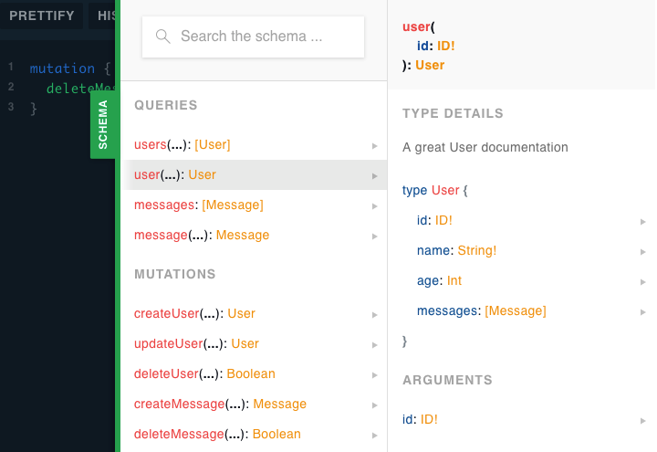

# GraphQL

<small>por [Adriano de Souza](mailto:souzadriano@gmail.com)</small>

---

## O que é GraphQL

> "GraphQL é uma linguagem de consulta para APIs. O GraphQL fornece uma descrição completa e compreensível dos dados em sua API, oferece aos clientes o poder de perguntar exatamente o que precisam e nada mais, facilita a evolução das APIs ao longo do tempo e permite ferramentas poderosas para desenvolvedores."
https://graphql.org

---

### Descreva seus dados:

```js
            type Project {
                name: String
                tagline: String
                contributors: [User]
            }
```

--

### Pergunte pelo que você deseja

```js
            {
                project(name: "GraphQL") {
                    tagline
                }
            }
```

--

### Obtenha resultados previsíveis

```js
            {
                "project": {
                    "tagline": "A query language for APIs"
                }
            }
```

---

## Conceitos

---

### Tipos Básicos

* ID
* Int
* Float
* String
* Boolean
* Enum

---

### Tipos customizados

```js

                type User {
                    id: ID!
                    name: String!
                    age: Int
                    messages: [Message]
                }

                type Message {
                    id: ID!
                    user: User!
                    text: String!
                }

```

---

### Definindo Consultas

```js

            type Query {
                users(offset: Int!, limit: Int!): [User]
                user(id: ID!): User

                messages: [Message]
                message(id: ID!): Message
            }

```

---

### Realizando consultas

```js
            query {                         
                users(0, 10) {                         
                    id                      
                    name                         
                    age                         
                    messages {                         
                        id                         
                        text                         
                    }                         
                }                         
            }

```

--

### Realizando consultas

```json
            {
            "data": {
                "users": [
                {
                    "id": "5c8c0bf3de6bd4135eb34ba2",
                    "name": "Adriano de Souza",
                    "age": 30,
                    "messages": [{
                        "id": "34dsfdsf43tdfgjg6778",
                        "text": "Hello World!"
                    }]
                },
                ]
            }
            }
            ```

---

### Definindo Alterações

```js

            type Mutation {
                createUser(name: String!, age: Int): User
                updateUser(id: ID!, name: String!, age: Int): User
                deleteUser(id: ID!): Boolean

                createMessage(message: String!, userId: ID!): Message
                deleteMessage(id: ID!): Boolean
            }

```

---

### Realizando alterações

Alteração:
```js
mutation {
    createMessage(text: "Hello World", userId: "5c8") {
        id
        text
    }
}
```

Resultado:
```json
{
    "data": {
        "createMessage": 
        {
            "id": "34dsfdsf43tdfgjg6778",
            "text": "Hello World!"
        }
    }
}
```

---

### Outros conceitos

* Subscription
* Fragment
* Interface
* entre outros

https://graphql.org/learn/

https://www.apollographql.com/docs/apollo-server/

---

### Diferenças entre o GraphQL e o REST


<small> https://blog.apollographql.com/graphql-vs-rest-5d425123e34b </small>

--

### Diferenças entre o GraphQL e o REST

REST:
```
GET /users/:id
GET /users/:id/messages
```

GraphQL:
```
query {
    user(id) {
        id
        name
        messages {
            id
            text
        }
    }
}
```

---

### Apollo Server

> "O Apollo Server é a melhor maneira de criar rapidamente uma API de auto-documentada e pronta para produção para clientes GraphQL, usando dados de qualquer origem."


---

### Hora do código
#### Dependências necessárias para este exemplo:

```bash
yarn add express
yarn add apollo-server apollo-server-express graphql graphql-resolve-batch
yarn add jsonwebtoken
yarn add mongoose

```

---

### Hora do código
#### Hello World

```js

const { ApolloServer, gql } = require('apollo-server-express');
const express = require('express');
const app = express();

const typeDefs = gql`
  type Query {
    hello: String
  }
`;

const resolvers = {
  Query: {
    hello: () => 'world'
  }
};

const server = new ApolloServer({
  typeDefs,
  resolvers,
});

server.applyMiddleware({ app });
app.listen({ port: 4000 }, () =>
  console.log(`Server ready at http://localhost:4000${server.graphqlPath}`)
)

```

---

### GraphQL Playground
<small>Ao subir o servidor apollo é disponibilizado no ambiente de desenvolvimento uma IDE para realizar consultas. (http://localhost:4000/graphql)<small>


---

### Hora do código
#### Definindo o schema

```js
const typeDefs = gql`
    type User {
        id: ID!
        name: String!
        age: Int
        messages: [Message]
    }
    type Message {
        id: ID!
        user: User!
        text: String!
    }
    type Query {
        users(offset: Int!, limit: Int!): [User]
        user(id: ID!): User
        messages: [Message]
        message(id: ID!): Message
    }
    type Mutation {
        createUser(name: String!, age: Int): User
        updateUser(id: ID!, name: String!, age: Int): User
        deleteUser(id: ID!): Boolean

        createMessage(message: String!, userId: ID!): Message
        deleteMessage(id: ID!): Boolean
    }
`;
```

---

### Hora do código
#### Codificando os resolvers

```js
const resolvers = {
  Query: {
    users: async (parent, { offset, limit }, context) => {
      return await User.find();
    },
    user: async (parent, { id }, context) => {
      return await User.findOne({ _id: id });
    },
    messages: async (parent, args, context) => {
      return await Message.find();
    },
    message: async (parent, { id }, context) => {
      return await Message.find({ _id: id });
    }
  }
};
```

---

### Hora do código
#### Codificando os resolvers

```js
const resolvers = {
  Query: { ... },
  Mutation: {
    createUser: async (parent, { name, age }, context) => {
      return await User.create({ name, age });
    },
    updateUser: async (parent, { id, name, age }, context) => {
      await User.updateOne({ _id: id }, { name, age });
      return await User.findOne({ _id: id });
    },
    deleteUser: async (parent, { id }, context) => {
      const deleted = await User.deleteOne({ _id: id });
      return deleted.ok === 1;;
    },
    createMessage: async (parent, { text, userId }, context) => {
        return await Message.create({ text, userId });
    },
    deleteMessage: async (parent, { id }, context) => {
        const deleted = await Message.deleteOne({ _id: id });
        return deleted.ok === 1;;
    },
  }
};
```

---

### Problema N+1

```js

const resolvers = {
  Query: { ... },
  Mutation: { ... },
  User: {
    messages: async ({ id }, args, context) => {
      return await Message.find({ userId: id });
    }
  },
  Message: {
    user: async ({ userId }, args, context) => {
      return await await User.findOne({ _id: userId });
    }
  }
};

```
Resultado

```
Mongoose: messages.find({}, { projection: {} })
Mongoose: users.findOne({ _id: ObjectId("5cacd38f392090164d24c525") }, { projection: {} })
Mongoose: users.findOne({ _id: ObjectId("5cacd38f392090164d24c525") }, { projection: {} })

```

---

### Resolvendo o Problema N+1

* Facebook DataLoader (https://github.com/graphql/dataloader)
<small>Busca de dados em lote genérico, com mais possibilidades de configuração e cache.</small>

* GraphQL Batch Resolver (https://github.com/calebmer/graphql-resolve-batch)
<small>Específico para o GraphQL e mais simples de utilizar.</small>

---

### Resolvendo o Problema N+1 - Codificando

```js
User: {
    messages: createBatchResolver(async (users, args, context) => {
      const keys = users.map((user) => user.id);
      const messages = await Message.find({ userId: { $in: keys } });
      const messagesByUser = messages.reduce((acc, message) => {
        if(!acc[message.userId]) acc[message.userId] = [];
        acc[message.userId].push(message);
        return acc;
      }, {});
      return keys.map((userId) => messagesByUser[userId] || []);
    })
  },
  Message: {
    user: createBatchResolver(async (messages, args, context) => {
      const keys = new Set();
      messages.forEach(({ userId }) => {
        keys.add(userId);
      });
      const users = await User.find({ _id: { $in: Array.from(keys) } });
      const usersById = users.reduce((acc, user) => {
        acc[user.id] = user;
        return acc;
      }, {});
      return messages.map(({userId}) => usersById[userId]);
    })
  }
```

--

### Resolvendo o Problema N+1 - Resultado

```
Mongoose: messages.find({}, { projection: {} })
Mongoose: users.find({ _id: { '$in': [ ObjectId("5cacd38f392090164d24c525") ] } }, { projection: {} })
```

---

### Autorização

Há diversas maneiras de realizar a autorização:

* Construir uma diretiva. Ex.: @auth
```
createUser(name: String!, age: Int): User @auth(hasRole: 'ADMIN')
```
* Adicionando no contexto e realizando a verificação no resolver
```
messages: async ({ id }, args, context) => {
    if (context.user.roles.indexOf('ADMIN') === -1 ) return throw new Error();
    ....
```
* Lib GraphQL Resolvers (https://github.com/lucasconstantino/graphql-resolvers)
````
messages: combineResolvers(isAdmin, async ({ id }, args, context) => { ...
```
* graphql-shield https://github.com/maticzav/graphql-shield
* Entre outras

---

### Documentação do Schema

<small>Ao construir o schema é gerada uma boa documentação base da API. Ainda é possível detalhar inserindo comentários.</small>

```
  """A great User documentation"""
  type User { ... }
```



---

# Perguntas ???